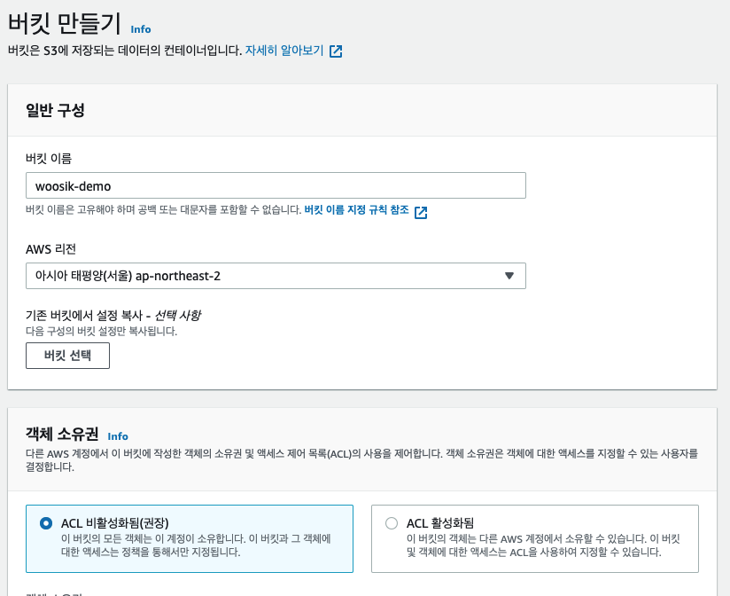
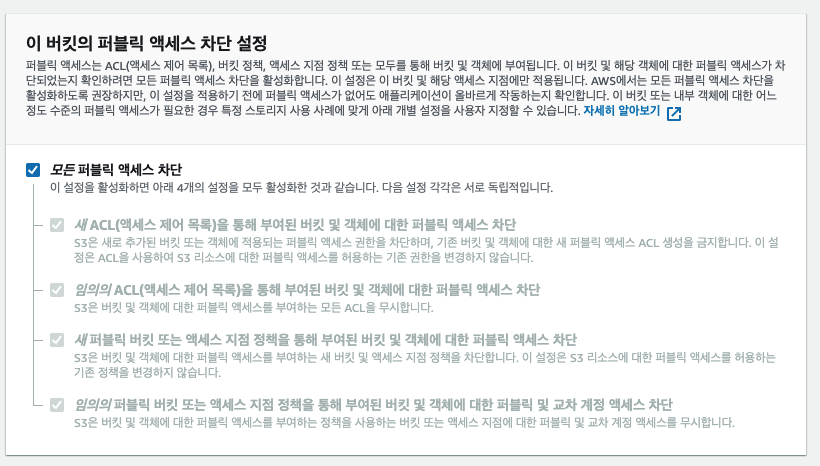
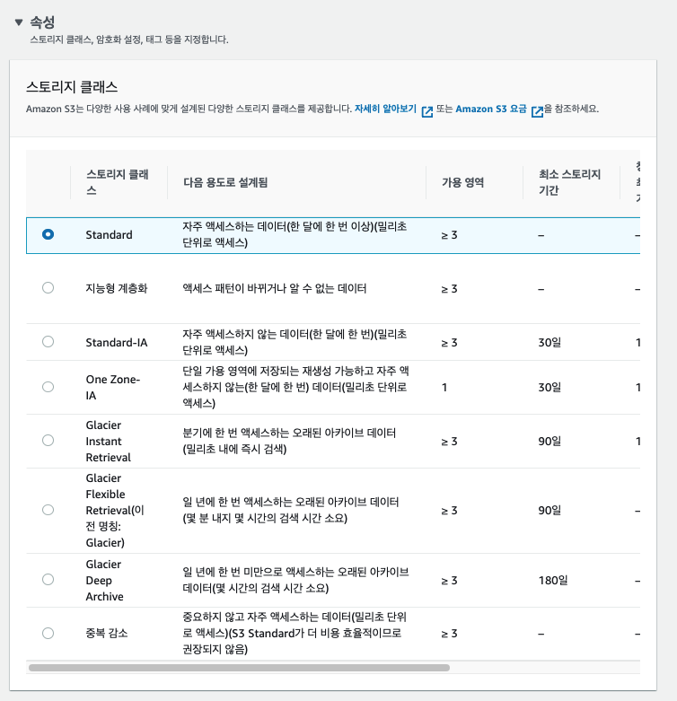
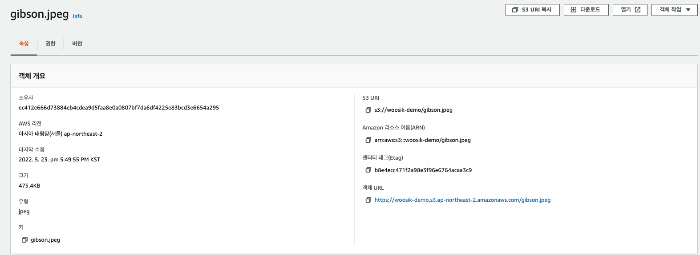
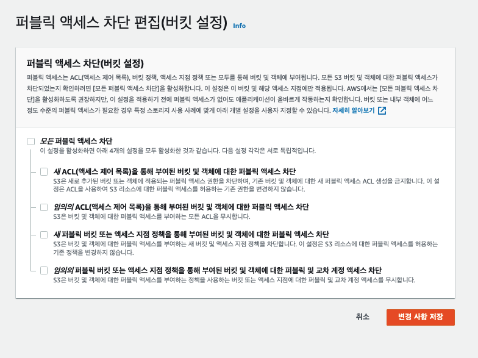

# S3 설정

## 버킷 만들기

    이름은 unique하게

    리전 지정해주기. 바꿀 수 없음.

    기본적으로 보안을 위해 s3 퍼블릭 엑세스 차단되어 있음.

## 객체 업로드 하기

    버킷 선택 > 업로드 >  파일 추가 > 업로드

    워크로드에 맞는 데이터 저장소 설정 가능.

## 객체 확인

    s3는 URL을 이용하여 해당 객체 접근할 수 있음. 

## 버킷 퍼블릭 접근 허용

    퍼블릭 차단 해제해주기

    s3 버킷 정책 만들어주기

정책 생성기를 통해 정책을 만들어 줄 수 있음. 

~~~
{
	"Version": "2012-10-17",
	"Statement": [
		{
			"Sid": "Statement1",  
			"Principal": "*",          //누구에게 허용할 것인지. "*" == 모두에게
			"Effect": "Allow",
			"Action": "s3:GetObject",  //무엇을, GetObject 객체를 읽을 수 있는 권한
			"Resource": "arn:aws:s3:::woosik-demo/gibson.jpeg" //대상 자원. 반드시 이 형식을 따라야 함. arn:aws:s3:::${BucketName}/${KeyName}
		}
	]
}
~~~

    변경사항 저장. 

    해당 객체의 URL을 브라우저에서 접속하면 열림.