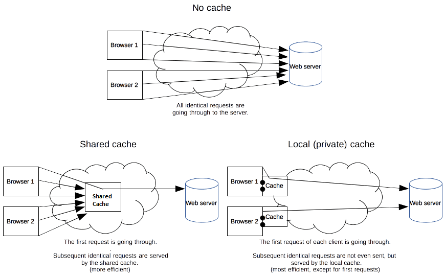

# Http Cache

## 정의

    브라우저는 서버가 내려준 리소스(자바스크립트, css) 정적파일들을 브라우저 캐시에 저장해두고 재사용함. 

    서버에 요청을 보내기 전에, Browser Cache에 해당 데이터가 있는지 먼저 확인함. 

## HTTP Header:  Cache-Control 

    서버의 데이터가 변경되어서 브라우저 캐시의 데이터와 차이가 생길 수 있음. 

    그래서, 캐시 데이터의 유효기간을 설정할 수 있음.
    
    서버는 Response Header에 

    Cache-Control: max-age=100000  : 만료시간

## Etag 

    만료시간이 지나더라도 데이터가 변경되지 않았으면, 또 다시 서버에서 불러와서 저장하는 것은 

    불필요한 네트워크 비용 발생.

    Etag="x234sdfa"

    일종의 해쉬값. 데이터가 같으면 해쉬값이 같고, 데이터가 변경되었으면 해쉬값이 다를 것이다.

    만료시간이 지나면 Request Header에 

    If-None-Match: "x234sdfa"를 담아서 보냄.

    1. 해쉬값이 같으면, 304 Not-Modified 상태코드와 Etag를 같이 보냄.  

    2. 데이터가 변경되었으면, 200 OK 상태코드와 새로운 Etag와 업데이트된 데이터를 전달함.

## 한계 

    HTTP Cache는 '만료'가 될 때까지는 계속 사용해야함.

    CSS같은 정적파일은 7일로 해두었다면, 클라이언트는 변경된 CSS를 볼 수 가 없다. 

    이럴때는 파일의 디지털 지문이나 버전 번호를 파일 이름에 포함하는 방식으로 수행.

    style.3da37df.css 처럼 하고 수정이 생기면 가운데 버전 번호를 수정하여 URL이 변경되도록하면 브라우저는 새롭게 다운로드 받음. 

    

## 참고 

https://developer.mozilla.org/ko/docs/Web/HTTP/Caching

https://www.youtube.com/watch?v=NxFJ-mJdVNQ