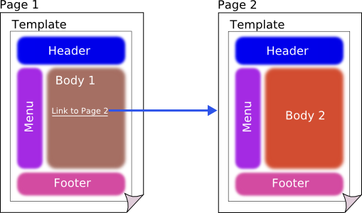

# Apcahe tiles

## tiles 란?

    tiles는 웹페이지의 상단이나 하단 메뉴와 같이 반복적으로 사용되는 부분들에 대한 코드를 분리해서 

    한 곳에서 관리를 가능하게 해주는 프레임워크

## JSP include와의 차이

    include를 사용할 경우, 공통페이지명이 바뀌면 사용되는 모든 곳을 수정해줘야하지만

    tiles의 경우, 설정 파일만 변경해주면 됨.

## Composite View 패턴

    모듈 단위의 뷰 들을 조합해서 하나의 뷰를 구성.

    하나의 전체 뷰를 부모로 볼 수 있고, 자식 뷰를 작은 한 부분으로 볼 수 있음.

    Leaf는 Component의 구현체

    Composite는 Component의 구현체들을 자식으로 삼는다. 

## 용어 

#### Template

    페이지 레이아웃.

    jsp파일로 페이지의 기본 골격을 구성하고 각 페이지의 실제 구성 내용은 definition에서 설정되는 Attribute 태그를 사용하여 런타임시 뿌려줌. 

    string 타입 Attribute 추가 : <titles:getAsString name="속성명" />

    template 및 definition Attribute 추가 : <tiles:insertAttribute name="속성명" />

#### Attribute

    Template의 빈 공간을 채우기 위해 사용되는 정보로 3가지 타입으로 구성.

    string : 직접 출력할 문자열

    template : 템플릿 내 또는 일부의 레이아웃을 기술

    definition : 전체 혹은 일부 Attribute들이 실제 내용으로 채워진 페이지. 
                 template과 attribute가 같이 정의된 페이지를 의미 

## maven 라이브러리 설정 - pom.xml

~~~java
<properties>
    <!-- /** tiles **/ -->
    <tiles.version>3.0.8</tiles.version>
</properties>

<dependency>
    <groupId>org.apache.tiles</groupId>
    <artifactId>tiles-core</artifactId>
    <version>${tiles.version}</version>
    <scope>compile</scope>
    <exclusions>
        <exclusion>
            <artifactId>jcl-over-slf4j</artifactId>
            <groupId>org.slf4j</groupId>
        </exclusion>
    </exclusions>
</dependency>

<dependency>
    <groupId>org.apache.tiles</groupId>
    <artifactId>tiles-servlet</artifactId>
    <version>${tiles.version}</version>
    <scope>compile</scope>
</dependency>

<dependency>
    <groupId>org.apache.tiles</groupId>
    <artifactId>tiles-jsp</artifactId>
    <version>${tiles.version}</version>
    <scope>compile</scope>
</dependency>
~~~

## TilesConfig

~~~java
import org.springframework.context.annotation.Bean;
import org.springframework.context.annotation.Configuration;
import org.springframework.web.servlet.view.tiles3.TilesConfigurer;
import org.springframework.web.servlet.view.tiles3.TilesView;
import org.springframework.web.servlet.view.tiles3.TilesViewResolver;

@Configuration
public class TilesConfig {

    @Bean
    public TilesConfigurer tilesConfigurer() {
        final TilesConfigurer configurer = new TilesConfigurer();
        //해당 경로에 tiles.xml 파일을 넣음
        configurer.setDefinitions(new String[]{"/WEB-INF/tiles/tiles.xml"});
        configurer.setCheckRefresh(true);
        return configurer;
    }

    @Bean
    public TilesViewResolver tilesViewResolver() {
        final TilesViewResolver tilesViewResolver = new TilesViewResolver();
        tilesViewResolver.setViewClass(TilesView.class);
        return tilesViewResolver;
    }
}
~~~

dispatcher-servlet.xml이 아닌 @Bean으로 추가해주는 방식을 씀. 

tiles.xml과 그 안에서 view에 맞는 해당 definition을 찾아줄 tilesViewResolver 추가.

## Tiles Definition

Tiles를 정의해줌. 

위 tilesConfigurer에서 setDefinitions에서 지정한 tiles.xml에 작성해준다. 

~~~html
<definition name="mainpage" template="/templates/layout.jsp">    
   <put-attribute name="header" value="/tiles/banner.jsp" /> 
   <put-attribute name="menu" value="/tiles/common_menu.jsp" /> 
   <put-attribute name="body" value="/tiles/home_body.jsp" /> 
   <put-attribute name="footer" value="/tiles/credits.jsp" /> 
</definition>
~~~

xml에 template과 attribute의 경로를 정의해줌. 

menu, header, footer는 자주 사용되므로 상속을 이용해서 중복을 피할 수 있음.

definition name 부분이 controller에서 뷰를 찾기 위해 반환하는 값.

~~~html
<definition name="views/lightstick/*/*/*/*/*" extends=".default">
    <put-attribute name="body" value="/WEB-INF/views/lightstick/{1}/{2}/{3}/{4}/{5}.jsp" />
</definition>
~~~

name의 패턴을 *을 사용해서 지정할 수 있는데, *는 아무 내용이나 들어갈 수 있음을 의미. 

그리고 *의 내용은 <put-attribute>의 value값에 {1}부터 순차적으로 들어간다. 

## Definition 상속

~~~html
<definition name="base" template="/templates/layout.jsp">
	<put-attribute name ="title" vlaue="Homepage" />
   <put-attribute name="header" value="/tiles/banner.jsp" /> 
   <put-attribute name="menu" value="/tiles/common_menu.jsp" /> 
   <put-attribute name="body" value="/tiles/home_body.jsp" /> 
   <put-attribute name="footer" value="/tiles/credits.jsp" /> 
</definition>

<definition name="home" extends="base">
	<put-attribute name ="title" vlaue="Offers Homepage" />
    <put-attribute name="body" value="/WEB-INF/tiles/home.jsp" />
</definition>
~~~

base라는 기본 설정을 extends 함으로써 부분만 또 바꿀수 있다. 

## Template

definition template의 위치와 일치하는 jsp에 작성

~~~html
<%@ page language="java" contentType="text/html; charset=UTF-8" pageEncoding="UTF-8"%>
<%@ taglib prefix="c" uri="http://java.sun.com/jsp/jstl/core"%> 
<%@ taglib uri="http://tiles.apache.org/tags-tiles" prefix="tiles"%> 
<!DOCTYPE html> 
<html lang="ko"> 
<head> 
    <meta http-equiv="Content-Type" content="text/html; charset=UTF-8" /> <title><tiles:getAsString name="title" /></title> 
    <link href="<c:url value='/resources/css/layout.css' />" rel="stylesheet"></link> 
</head> 
<body> 
    <header id="header"> 
        <tiles:insertAttribute name="header" /> 
    </header> 
        
    <section id="sidemenu"> 
        <tiles:insertAttribute name="menu" /> 
    </section> 

    <section id="siteContent"> 
        <tiles:insertAttribute name="body" /> 
    </section> 

    <footer id="footer"> 
        <tiles:insertAttribute name="footer" /> 
    </footer> 
</body> 
</html>
~~~

## 참고  

https://sjh836.tistory.com/133

https://tiles.apache.org/framework/tutorial/index.html

https://hyoni-k.tistory.com/39

https://offbyone.tistory.com/10

http://jmlim.github.io/spring/2019/02/08/spring-boot-tiles/