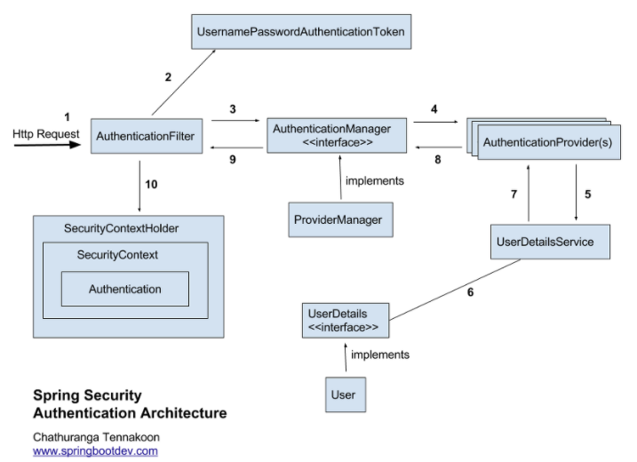
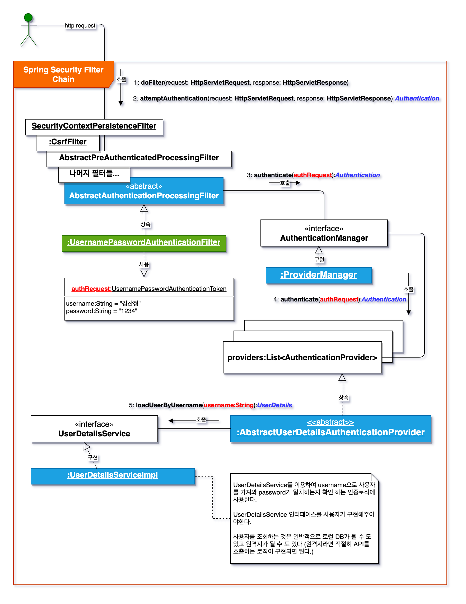

# 스프링 시큐리티 

## 개념

    Spring 기반 애플리케이션에 인증과 권한 부여를 모두 제공하는데 중점을 둔 프레임워크. 

    "인증"과 "권한"에 대한 부분을 Filter의 흐름으로 처리.

    기본적으로 인증 절차를 거친후에 인가 절차를 진행. 

    인가 과정에서 해당 리소스에 대한 접근 권한이 있는지 확인. 

    Principal을 아이디로, Credential을 비밀번호로 사용하는 Credential 기반의 인증방식 사용.

## 세션-쿠키 방식

    기본적으로 세션-쿠키 방식으로 인증. 

    세션-쿠키에 대한 개념은 아래 링크 참조 

## 인증과 인가 

#### Authentication : 인증

    로그인과 같이 사용자의 신원을 확인하는 프로세스.
    
    일반적인 인증방법은 비밀번호를 사용하는 것.

    세션저장방식, JWT방식, OAuth 방식 등이 있다. 

#### Authorization : 인가

    누가 무엇을 할 수 있는지 결정하는 규칙 

    읽기, 수정, 삭제를 허용여부를 확인하는 것. 

    사용자의 신원이 성공적으로 인증된 후에 발생. 

## 구조 

    1. 요청이 들어오면 AuthenticationFilter 통해 6번까지 진행. 
    2. 존재하는 User이면 UserDetails로 꺼내서 7~10까지 진행. 
    3. spring security의 인메모리 세션저장소인 SecurityContextHolder에 세션저장. 
    4. 유저에게 저장한 SessionId를 쿠키에 담아 내려줌. 

## 동작흐름 

1. 유저가 아이디와 비밀번호를 입력후, 로그인 요청을 보내면
2. 

## 참고 

https://kimchanjung.github.io/programming/2020/07/01/spring-security-01/

https://velog.io/@sa833591/Spring-Security-5-Spring-Security-Filter-%EC%A0%81%EC%9A%A9

https://www.youtube.com/watch?v=ry2pRoAnrIc&t=0s

https://velog.io/@dhk22/Spring-Security-%EC%84%B8%EC%85%98%EC%9D%84-%EC%9D%B4%EC%9A%A9%ED%95%9C-%EB%A1%9C%EA%B7%B8%EC%9D%B8-%EC%B2%98%EB%A6%AC

https://iyk2h.tistory.com/158

https://baek.dev/post/24/