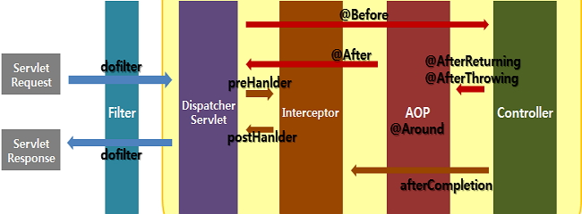

# 인터셉터



## 정의

    컨트롤러에 들어오는 요청과 컨트롤러의 응답을 가로채는 역할.

    관리자 인증을 하는 용도로 활용가능.

    Filter는 DispatcherServlet 실행 전 스프링 컨텍스트의 바깥에 존재, Interceptor는 실행 후.

## 장점 

    공통 코드 사용으로 재사용성 증가

    메모리 낭비, 서버 부하 감소

    코드 누락에 대한 위험성 감소

##  구현

HandlerInterceptorAdapter클래스를 상속받으면, preHandle()만 구현해주면 됨.

postHandle(), afterConpletion()은 이미 구현되어있음.

```java
    public class MyInterceptor extends HandlerInterceptorAdapter{
        @Override
        //Controller에 도착하기 전 동작하는 메서드
        public boolean preHandle(HttpServletRequest request, HttpServletResponse response, Object handler) throws Exception{
            
            System.out.println("MyInterCeptor - preHandle");
		    
            //return 값이 true면 진행. false면 Controller 진입 x
            return true; 
        }
    }

```

## WebMvcConfigurer

    인터셉터 관련 설정을 과거에는 .xml에서 해줬다면 이젠 자바 클래스에서 해줌

```java
    @Configuration
    public class DispatcherServlet implements WebMvcConfigurer{

        @Override
        public void addInterceptors(InterceptorRegistry registry){
            //적용시킬 특정 api URI 추가, 제외 가능
            registry.addInterceptor(new MyInterceptor()).addPathPatterns("/api/board").excludePatterns("/css");
        }
    }
```

## 참고

https://myhappyman.tistory.com/199

https://velog.io/@hanblueblue/Spring-xml-configuration%EC%9D%84-java-configuration%EC%9C%BC%EB%A1%9C-%EB%B3%80%EA%B2%BD%ED%95%98%EA%B8%B0-2-Web.xml-dispatcher-servlet